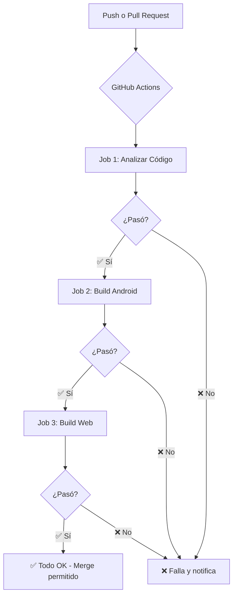

# 🤖 GitHub Actions - CI/CD Automático

## 📋 ¿Qué es GitHub Actions?

**GitHub Actions** es un sistema de **Integración Continua/Despliegue Continuo (CI/CD)** gratuito incluido en GitHub. Ejecuta tareas automáticamente en la nube cuando ocurren eventos en tu repositorio.

## 🎯 ¿Para qué sirve?

### Escenario SIN GitHub Actions:

```
👨‍💻 Developer → Hace commit con error → Push a GitHub → 💣
                                           ↓
                            ❌ Error llega a producción
                            ❌ Otros devs descargan código roto
                            ❌ Pérdida de tiempo debuggeando
```

### Escenario CON GitHub Actions:

```
👨‍💻 Developer → Push a GitHub → 🤖 GitHub Actions se activa
                                           ↓
                              🔍 Analiza el código
                              🧪 Ejecuta tests
                              🔨 Construye la app
                                           ↓
                    ✅ Todo OK → Merge permitido ✓
                    ❌ Hay error → ¡Bloquea el merge! ✗
```

## 🚀 Beneficios

| Beneficio | Descripción |
|-----------|-------------|
| 🛡️ **Protección automática** | Nadie puede hacer merge de código con errores |
| ⚡ **Feedback inmediato** | Sabes en 2-3 minutos si tu código está bien |
| 🤝 **Trabajo en equipo** | Todos siguen las mismas reglas automáticamente |
| 🎯 **Calidad garantizada** | Solo código verificado llega a main |
| 💰 **Gratis** | GitHub Actions es gratis para repos públicos y privados (con límites generosos) |

## 📊 Nuestro Workflow: `flutter_ci.yml`

### Flujo Completo:



### Desglose de Jobs:

#### 🔍 **Job 1: Análisis Estático** (2-3 min)
```yaml
- Instala Flutter 3.19.0
- Descarga dependencias (pub get)
- Verifica formato (dart format)
- Ejecuta linter (flutter analyze --fatal-warnings)
- Detecta APIs deprecadas
```

**¿Qué detecta?**
- ❌ Código mal formateado
- ❌ print() en producción
- ❌ APIs deprecadas (withOpacity, etc.)
- ❌ Variables no usadas
- ❌ Imports innecesarios
- ❌ BuildContext en funciones async

#### 🤖 **Job 2: Build Android** (5-8 min)
```yaml
- Construye APK release
- Sube artifact para descargar
- Verifica que la compilación no tenga errores
```

**Beneficio:** Detecta errores que solo aparecen en build release.

#### 🌐 **Job 3: Build Web** (3-5 min)
```yaml
- Construye versión web
- Optimiza assets
- Genera artifact descargable
```

**Beneficio:** Asegura compatibilidad web.

## 🔧 Configuración Inicial (Una sola vez)

### Paso 1: Crear el archivo workflow

Ya está creado en `.github/workflows/flutter_ci.yml` ✅

### Paso 2: Subir a GitHub

```bash
git add .github/
git commit -m "ci: agregar GitHub Actions workflow"
git push origin main
```

### Paso 3: Verificar en GitHub

1. Ve a tu repositorio en GitHub.com
2. Haz clic en la pestaña **"Actions"**
3. Deberías ver tu workflow "Flutter CI"

## 📱 Uso Diario

### Cuando haces Push:

```bash
git push origin feature/nueva-funcionalidad
```

**Automáticamente:**
1. GitHub detecta el push
2. Ejecuta el workflow en la nube
3. Te notifica por email si hay errores
4. Puedes ver el progreso en la pestaña "Actions"

### Cuando creas Pull Request:

```bash
# En GitHub, creas un PR de feature → main
```

**Automáticamente:**
1. GitHub ejecuta todas las verificaciones
2. Si pasa ✅ → Botón "Merge" se habilita
3. Si falla ❌ → Botón "Merge" se bloquea
4. Los revisores ven los resultados

## 👀 Monitorear Ejecuciones

### Ver estado actual:

1. **En GitHub Web:**
   - Ve a tu repo → Pestaña "Actions"
   - Verás lista de ejecuciones
   - Haz clic en una para ver detalles

2. **En tu PR:**
   - Verás checks al final del PR:
     ```
     ✅ Analyze / Flutter CI (pull_request)
     ✅ Build Android / Flutter CI (pull_request)
     ✅ Build Web / Flutter CI (pull_request)
     ```

3. **Badge en README:**
   Puedes agregar un badge que muestre el estado:
   
   ```markdown
   
   ```

## 🎛️ Personalización

### Cambiar versión de Flutter:

```yaml
- name: 🐦 Setup Flutter
  uses: subosito/flutter-action@v2
  with:
    flutter-version: '3.24.0'  # ← Cambiar aquí
```

### Ejecutar solo en main:

```yaml
on:
  push:
    branches: 
      - main  # Solo main
```

### Agregar notificaciones de Slack:

```yaml
- name: Notify Slack
  uses: 8398a7/action-slack@v3
  with:
    status: ${{ job.status }}
    webhook_url: ${{ secrets.SLACK_WEBHOOK }}
```

## 💰 Costos y Límites

### Plan GitHub Free:

| Recurso | Límite |
|---------|--------|
| **Minutos/mes** | 2,000 min gratis |
| **Storage** | 500 MB gratis |
| **Repos privados** | ✅ Incluidos |
| **Repos públicos** | ✅ Ilimitado |

**Nuestro workflow:** ~10 minutos por ejecución

- 2,000 min / 10 min = **~200 ejecuciones/mes gratis**
- Suficiente para equipos pequeños

### Si te quedas sin minutos:

1. **Optimizar:** Deshabilitar jobs no críticos
2. **Actualizar:** GitHub Pro ($4/mes) = 3,000 min
3. **Self-hosted runners:** Gratis, usa tu propia máquina

## 🔍 Debugging Workflows

### Si un job falla:

1. **Ve a Actions → Click en la ejecución fallida**
2. **Click en el job rojo**
3. **Expande los pasos para ver el error**
4. **Copia el error y corrígelo localmente**

### Ejecutar localmente (con act):

```bash
# Instalar act (simula GitHub Actions local)
# Mac: brew install act
# Windows: choco install act

# Ejecutar workflow local
act push
```

## 📚 Recursos Adicionales

- [GitHub Actions Docs](https://docs.github.com/en/actions)
- [Flutter CI/CD Guide](https://docs.flutter.dev/deployment/cd)
- [Awesome Actions](https://github.com/sdras/awesome-actions)
- [Action Marketplace](https://github.com/marketplace?type=actions)

## 🎯 Próximos Pasos (Opcional)

1. **Agregar tests unitarios** y habilitar Job 2
2. **Deploy automático** a Firebase Hosting en merge a main
3. **Notificaciones** de Slack/Discord
4. **Análisis de cobertura** con Codecov
5. **Seguridad** con CodeQL scanning

---

## ❓ FAQ

**P: ¿GitHub Actions es gratis?**  
R: Sí, 2,000 minutos/mes gratis para repos privados. Ilimitado para públicos.

**P: ¿Puedo desactivarlo temporalmente?**  
R: Sí, ve a Actions → Click en el workflow → "..." → Disable workflow

**P: ¿Funciona con repos privados?**  
R: Sí, perfectamente.

**P: ¿Qué pasa si falla?**  
R: Recibes un email y el PR se bloquea hasta que corrijas el error.

**P: ¿Puedo ejecutarlo solo en ciertos archivos?**  
R: Sí, puedes agregar filtros de paths:
```yaml
on:
  push:
    paths:
      - 'lib/**'
      - 'test/**'
```

