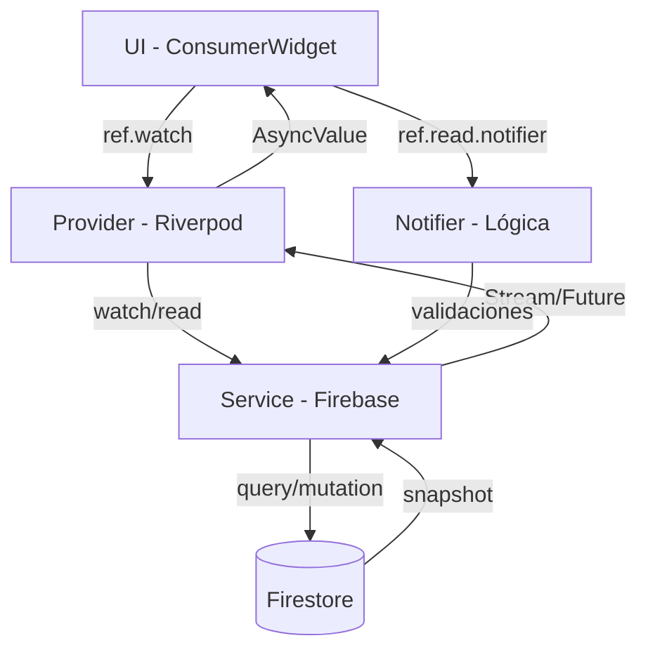

# CHANGELOG - Sistema de Horarios Flexible

**Fecha:** 12 Febrero 2026  
**Proyecto:** Control Horario - Escuela de Música  
**Fase:** FASE 2 - Backend + Lógica de Negocio  
**Sprint:** Sistema de Horarios Flexible

---

## 📋 Resumen Ejecutivo

Se implementó un **sistema completo de gestión de horarios flexible** que permite manejar múltiples tipos de jornadas laborales (40h, 35h, 25h, 20h, 15h) con diferentes configuraciones horarias (9-17h, 10-18h, jornada partida, etc.).

### ✅ Estado: IMPLEMENTACIÓN COMPLETA

**Funcionalidades implementadas:**
- ✅ Plantillas de horario reutilizables (CRUD completo)
- ✅ Horarios personalizados por empleado
- ✅ Editor visual de horarios semanales
- ✅ Asignación de horarios al crear/editar empleados
- ✅ Visualización en tiempo real desde Firebase
- ✅ Validaciones y cálculos automáticos

---

## 🏗️ Arquitectura Implementada

Siguiendo estrictamente `.cursorrules` con separación en capas:

```
CAPA 1: Models (Freezed)
  ├── ScheduleModel (plantillas)
  ├── DaySchedule (configuración diaria)
  ├── TimeShift (turnos)
  └── UserModel actualizado

CAPA 2: Services (Firebase)
  ├── ScheduleService (CRUD Firestore)
  └── FirebaseService actualizado

CAPA 3: Providers (Riverpod)
  ├── schedule_management_provider (lógica CRUD)
  └── employee_schedule_provider (obtener horario completo)

CAPA 4: Presentation (UI/UX)
  ├── WeekScheduleEditor (editor interactivo)
  ├── ScheduleTemplateModal (crear/editar plantillas)
  ├── EmployeeScheduleEditorModal (asignar horario a empleado)
  ├── EmployeeInfoEditorModal (editar info general)
  └── Screens actualizadas

CAPA 5: Configuración
  ├── firestore.rules (seguridad)
  └── seed_service (plantillas iniciales)
```

---

## 📁 Archivos Creados (Nuevos)

### Modelos
```
lib/features/admin/models/
  └── schedule_model.dart               ✅ Plantilla de horario con freezed
      ├── schedule_model.freezed.dart   (generado)
      └── schedule_model.g.dart          (generado)
```

### Services
```
lib/core/services/
  └── schedule_service.dart             ✅ CRUD de plantillas en Firestore
```

### Providers
```
lib/features/admin/providers/
  └── schedule_management_provider.dart ✅ Lógica CRUD plantillas
      └── schedule_management_provider.g.dart (generado)

lib/features/dashboard/providers/
  └── employee_schedule_provider.dart   ✅ Obtener horario completo empleado
      └── employee_schedule_provider.g.dart (generado)
```

### UI/Widgets
```
lib/shared/widgets/editors/
  └── week_schedule_editor.dart         ✅ Editor interactivo horario semanal

lib/features/admin/presentation/widgets/
  ├── schedule_template_modal.dart      ✅ Modal crear/editar plantillas
  ├── employee_schedule_editor_modal.dart ✅ Modal asignar horario a empleado
  └── employee_info_editor_modal.dart   ✅ Modal editar info general empleado
```

---

## 🔧 Archivos Modificados

### Modelos
```
lib/features/auth/models/user_model.dart
  ✅ Añadidos campos:
     - scheduleType: "template" | "custom"
     - scheduleId: Referencia a plantilla
     - customSchedule: Horario personalizado embebido
```

### Services
```
lib/core/services/firebase_service.dart
  ✅ Añadido provider: scheduleServiceProvider

lib/core/services/seed_service.dart
  ✅ Creación de 7 plantillas iniciales:
     1. Jornada 40h (9:00-17:00)
     2. Jornada 40h (10:00-18:00)
     3. Jornada 40h (8:30-16:30)
     4. Jornada 35h (9:00-16:00)
     5. Jornada Tarde 25h (15:00-20:00)
     6. Media Jornada 20h (9:00-13:00)
     7. Part-Time 15h (Lun/Mié/Vie 15:00-20:00)
```

### Providers
```
lib/features/auth/providers/auth_provider.dart
  ✅ Añadido provider: userByIdProvider(userId)

lib/features/admin/providers/user_management_provider.dart
  ✅ Añadido método: updateEmployee(userId, updates)
```

### UI/Screens
```
lib/features/admin/presentation/screens/schedule_management_screen.dart
  ✅ Convertido a ConsumerWidget
  ✅ Conectado a allScheduleTemplatesProvider
  ✅ FAB "Nueva Plantilla" (solo cuando hay plantillas)
  ✅ Click en tarjeta abre modal de edición

lib/features/admin/presentation/screens/employee_detail_screen.dart
  ✅ Convertido a ConsumerWidget
  ✅ Conectado a userByIdProvider
  ✅ Muestra datos reales desde Firebase
  ✅ Botón "Editar" → EmployeeInfoEditorModal
  ✅ Botón "Editar Horario" → EmployeeScheduleEditorModal

lib/features/admin/presentation/widgets/new_employee_drawer.dart
  ✅ Dropdown "Horario" conectado a allScheduleTemplatesProvider
  ✅ Guarda scheduleId al crear empleado

lib/features/admin/presentation/widgets/week_schedule_viewer.dart
  ✅ Convertido a ConsumerWidget
  ✅ Conectado a employeeFullScheduleProvider
  ✅ Muestra plantilla o custom schedule
  ✅ Soporte para múltiples turnos (jornada partida)
```

### Configuración
```
firestore.rules
  ✅ Añadidas reglas para colección schedules:
     - Lectura: Todos los usuarios autenticados
     - Escritura: Solo admin y RRHH
  ✅ Desplegadas a Firebase: firebase deploy --only firestore:rules
```

---

## 🎯 Funcionalidades Implementadas

### Para Administradores:

#### 1️⃣ Gestión de Plantillas de Horario
- ✅ Ver lista de plantillas activas
- ✅ Crear nueva plantilla con editor visual
- ✅ Editar plantilla existente
- ✅ Ver contador de empleados usando cada plantilla
- ✅ Validaciones automáticas (nombre, turnos, horas)

#### 2️⃣ Asignación de Horarios
- ✅ Dropdown con plantillas disponibles al crear empleado
- ✅ Modal para asignar/cambiar horario de empleado existente
- ✅ Opción entre plantilla o horario personalizado
- ✅ Editor de horario custom con WeekScheduleEditor

#### 3️⃣ Edición de Empleados
- ✅ Modal para editar información general (nombre, email, cargo, etc.)
- ✅ Modal independiente para editar horario
- ✅ Actualización en Firebase
- ✅ Validaciones de formulario

#### 4️⃣ Visualización
- ✅ Detalle de empleado muestra datos reales de Firebase
- ✅ Horario laboral completo con turnos detallados
- ✅ Actualización en tiempo real

### Para Empleados:

#### 5️⃣ Ver Su Horario
- ✅ Visualización de horario completo (plantilla o custom)
- ✅ Actualización automática si admin cambia plantilla
- ✅ Soporte para jornada partida (múltiples turnos)

---

## 🔄 Flujo de Datos Implementado



### Ejemplo Concreto: Crear Plantilla

```
1. Admin: Click "Crear Plantilla"
   ↓
2. UI: ScheduleTemplateModal
   - Formulario con WeekScheduleEditor
   - Usuario configura horario
   ↓
3. UI: Click "Guardar"
   ↓
4. Provider: scheduleManagementProvider.notifier.createTemplate()
   - Valida nombre no vacío
   - Valida al menos 1 turno
   - Calcula horas totales
   - Obtiene usuario autenticado
   ↓
5. Service: scheduleService.createTemplate()
   - Genera ID único
   - Serializa weeklySchedule
   - Crea documento en Firestore
   ↓
6. Firestore: schedules/{scheduleId}
   - Documento creado
   ↓
7. Stream: allScheduleTemplatesProvider
   - Detecta cambio automáticamente
   - Notifica a UI
   ↓
8. UI: Lista se actualiza en tiempo real
   - Nueva plantilla aparece automáticamente
```

---

## 🗄️ Estructura de Datos en Firebase

### Colección: `schedules` (Plantillas)

```javascript
schedules/{scheduleId}
{
  scheduleId: "schedule_40h_9_17",
  name: "Jornada 40h (9:00-17:00)",
  description: "Lunes a Viernes con 1h pausa",
  totalWeeklyHours: 40,
  isActive: true,
  isTemplate: true,
  usedByCount: 3,  // Contador automático
  weeklySchedule: {
    monday: {
      isWorkDay: true,
      shifts: [
        { startTime: "09:00", endTime: "17:00" }
      ],
      breakMinutes: 60,
      dailyHours: 8.0
    },
    tuesday: { ... },
    // ... resto de días
  },
  createdAt: Timestamp,
  createdBy: "userId",
  lastModifiedAt: Timestamp,
  lastModifiedBy: "userId"
}
```

### Colección: `users` (Campos Nuevos)

```javascript
users/{userId}
{
  // ... campos existentes ...
  
  // === HORARIO (NUEVOS) ===
  scheduleType: "template",        // o "custom"
  scheduleId: "schedule_40h_9_17", // si usa plantilla
  customSchedule: {                // si es custom
    monday: { isWorkDay: true, shifts: [...] },
    // ...
  },
  weeklyHours: 40,
}
```

---

## 🔒 Reglas de Seguridad (Firestore Rules)

```javascript
// Colección: schedules
match /schedules/{scheduleId} {
  // Lectura: Todos los usuarios autenticados
  // (necesario para dropdowns)
  allow read: if request.auth != null;
  
  // Escritura: Solo admin y RRHH
  allow create, update, delete: if isAdmin();
}
```

**✅ Desplegadas:** `firebase deploy --only firestore:rules` (12/02/2026)

---

## 🐛 Problemas Encontrados y Soluciones

### 1. Error de Permisos Firebase
**Problema:** `[cloud_firestore/permission-denied]` al cargar plantillas  
**Causa:** Reglas no desplegadas a Firebase  
**Solución:** Ejecutado `firebase deploy --only firestore:rules`  
**Estado:** ✅ Resuelto

### 2. Error "Usuario no autenticado"
**Problema:** Excepción al crear plantilla  
**Causa:** `ref.read(currentUserProvider).valueOrNull` retornaba null durante carga  
**Solución:** Cambiado a `await ref.read(currentUserProvider.future)`  
**Archivos:** `schedule_management_provider.dart`  
**Estado:** ✅ Resuelto

### 3. FAB duplicado en estado vacío
**Problema:** Dos botones "Crear Plantilla" simultáneos  
**Causa:** FAB flotante siempre visible  
**Solución:** FAB solo visible cuando `templates.isNotEmpty`  
**Archivos:** `schedule_management_screen.dart`  
**Estado:** ✅ Resuelto

### 4. Dropdown crash con scheduleId inválido
**Problema:** `Assertion failed: DropdownButton's value template_001 doesn't exist`  
**Causa:** Empleado con scheduleId de plantilla eliminada/inexistente  
**Solución:** Validación defensiva + warning al usuario  
**Archivos:** `employee_schedule_editor_modal.dart`  
**Código:**
```dart
// Validar que scheduleId existe en lista
final validScheduleId = templates.any((t) => t.scheduleId == _selectedScheduleId)
    ? _selectedScheduleId
    : null;

// Si no existe, mostrar warning
if (widget.employee.scheduleId != null && validScheduleId == null) {
  // Mostrar banner de advertencia
}
```
**Estado:** ✅ Resuelto

### 5. Deprecaciones de RadioListTile
**Problema:** Warning de `groupValue` y `onChanged` deprecated  
**Impacto:** Solo warnings, funcionalidad OK  
**Estado:** ⚠️ No crítico (se actualizará en refactor futuro)

---

## 🎨 Componentes UI Creados

### 1. WeekScheduleEditor
**Ubicación:** `lib/shared/widgets/editors/week_schedule_editor.dart`  
**Tipo:** StatefulWidget (permitido por .cursorrules para UI local)  
**Funcionalidades:**
- ✅ Switch para marcar días laborables
- ✅ Añadir/eliminar múltiples turnos por día
- ✅ TimePicker para seleccionar horarios
- ✅ Auto-cálculo de horas diarias y semanales
- ✅ Badge con total de horas en tiempo real
- ✅ Validación visual (colores según estado)

**Ejemplo visual:**
```
┌─────────────────────────────────────┐
│ 🕐 Total: 40 horas semanales        │
├─────────────────────────────────────┤
│ [✓] Lunes                     8.0h  │
│     🕐 09:00 — 17:00  [🗑️]          │
│     [+ Añadir turno]                 │
├─────────────────────────────────────┤
│ [✓] Martes                    8.0h  │
│ ...                                  │
└─────────────────────────────────────┘
```

### 2. ScheduleTemplateModal
**Ubicación:** `lib/features/admin/presentation/widgets/schedule_template_modal.dart`  
**Tipo:** ConsumerStatefulWidget  
**Modos:**
- Crear: `existingTemplate = null`
- Editar: `existingTemplate = ScheduleModel`

**Funcionalidades:**
- ✅ Formulario con validaciones
- ✅ Integra WeekScheduleEditor
- ✅ Auto-cálculo y validación de horas
- ✅ Loading state durante guardado
- ✅ Mensajes de éxito/error

### 3. EmployeeScheduleEditorModal
**Ubicación:** `lib/features/admin/presentation/widgets/employee_schedule_editor_modal.dart`  
**Tipo:** ConsumerStatefulWidget  
**Funcionalidades:**
- ✅ Radio buttons: "Plantilla" vs "Custom"
- ✅ Dropdown con plantillas disponibles
- ✅ WeekScheduleEditor para custom
- ✅ Validación defensiva de scheduleId inválidos
- ✅ Warning si plantilla anterior no existe
- ✅ Guarda en Firebase con updateEmployee()

### 4. EmployeeInfoEditorModal
**Ubicación:** `lib/features/admin/presentation/widgets/employee_info_editor_modal.dart`  
**Tipo:** ConsumerStatefulWidget  
**Funcionalidades:**
- ✅ Editar datos personales (nombre, DNI, teléfono)
- ✅ Editar datos laborales (cargo, departamento, empresa)
- ✅ Editar horas semanales contratadas
- ✅ Toggle estado activo/inactivo
- ✅ Validaciones de formulario
- ✅ Actualización automática de displayName

---

## 🔄 Screens Actualizadas

### 1. ScheduleManagementScreen
**Antes:**
- ❌ Mock data estático
- ❌ Sin crear/editar
- ❌ FAB siempre visible

**Ahora:**
- ✅ Conectado a Firebase (allScheduleTemplatesProvider)
- ✅ CRUD completo desde UI
- ✅ FAB solo cuando hay plantillas
- ✅ Estados: loading, error, empty, data

### 2. EmployeeDetailScreen
**Antes:**
- ❌ Mock data estático
- ❌ Botones "en desarrollo"
- ❌ Sin edición

**Ahora:**
- ✅ Conectado a Firebase (userByIdProvider)
- ✅ Datos reales del empleado
- ✅ Botón "Editar" → Modal info general
- ✅ Botón "Editar Horario" → Modal horario
- ✅ WeekScheduleViewer conectado
- ✅ Estados: loading, error, not found

### 3. NewEmployeeDrawer
**Antes:**
- ❌ Dropdown con mock data
- ❌ No guardaba scheduleId

**Ahora:**
- ✅ Dropdown conectado a allScheduleTemplatesProvider
- ✅ Guarda scheduleId en Firebase
- ✅ Estados: loading, error, success

### 4. WeekScheduleViewer
**Antes:**
- ❌ Mock data estático

**Ahora:**
- ✅ Conectado a employeeFullScheduleProvider
- ✅ Muestra plantilla o custom
- ✅ Actualización en tiempo real
- ✅ Soporte jornada partida

---

## 📊 Providers Implementados

### Stream Providers (Lectura en Tiempo Real)

#### `allScheduleTemplatesProvider`
```dart
@riverpod
Stream<List<ScheduleModel>> allScheduleTemplates(ref) {
  final service = ref.watch(scheduleServiceProvider);
  return service.watchActiveTemplates();
}
```
**Usado en:**
- schedule_management_screen (lista de plantillas)
- new_employee_drawer (dropdown al crear)
- employee_schedule_editor_modal (dropdown al editar)

#### `scheduleByIdProvider(scheduleId)`
```dart
@riverpod
Stream<ScheduleModel?> scheduleById(ref, String scheduleId) {
  final service = ref.watch(scheduleServiceProvider);
  return service.watchScheduleById(scheduleId);
}
```
**Usado en:**
- employee_schedule_provider (obtener plantilla)
- schedule_management (validar antes de eliminar)

#### `userByIdProvider(userId)`
```dart
@riverpod
Stream<UserModel?> userById(ref, String userId) {
  final authService = ref.watch(authServiceProvider);
  return authService.userDataStream(userId);
}
```
**Usado en:**
- employee_detail_screen (datos del empleado)
- employee_schedule_provider (combinar user + schedule)

#### `employeeFullScheduleProvider(userId)`
```dart
@riverpod
Future<EmployeeScheduleData?> employeeFullSchedule(ref, String userId) {
  // Obtiene user y combina con template/custom
  // Retorna horario unificado
}
```
**Usado en:**
- week_schedule_viewer (visualización de horario)
- profile_screen (vista empleado - futuro)

### Notifier Providers (Mutations)

#### `ScheduleManagement` (CRUD Plantillas)
```dart
@riverpod
class ScheduleManagement extends _$ScheduleManagement {
  Future<String> createTemplate(...);
  Future<void> updateTemplate(...);
  Future<void> deleteTemplate(...);
}
```
**Validaciones implementadas:**
- ✅ Nombre no vacío
- ✅ Al menos 1 turno configurado
- ✅ Usuario autenticado (await .future)
- ✅ No eliminar si está en uso (usedByCount > 0)

#### `UserManagement` (Actualizar Empleado)
```dart
@riverpod
class UserManagement extends _$UserManagement {
  Future<Map<String, String>?> createEmployee(...);
  Future<void> updateEmployee(userId, updates); // ✅ NUEVO
}
```

---

## 🛡️ Validaciones Implementadas

### En Providers (Lógica de Negocio)

#### ScheduleManagement
```dart
✅ createTemplate():
   - Nombre no vacío
   - Al menos 1 turno (totalHours > 0)
   - Usuario autenticado

✅ updateTemplate():
   - Si cambia weeklySchedule, validar turnos
   - Usuario autenticado

✅ deleteTemplate():
   - usedByCount == 0 (no está en uso)
```

#### UserManagement
```dart
✅ updateEmployee():
   - Updates no vacío
   - Firestore operation success
```

### En UI (Formularios)

#### ScheduleTemplateModal
```dart
✅ Formulario:
   - Nombre obligatorio
   - WeekScheduleEditor con estado válido

✅ Visual:
   - Badge rojo si 0 horas
   - Badge verde si > 0 horas
   - Deshabilitar guardar si inválido
```

#### EmployeeScheduleEditorModal
```dart
✅ Tipo Template:
   - scheduleId obligatorio
   
✅ Tipo Custom:
   - Al menos 1 turno configurado (totalHours > 0)

✅ Defensiva:
   - Validar que scheduleId existe en lista
   - Mostrar warning si plantilla no existe
```

#### EmployeeInfoEditorModal
```dart
✅ Campos obligatorios:
   - Nombre
   - Apellido1
   - Email válido (@)
   - Horas semanales > 0
```

---

## 🧪 Testing Realizado

### ✅ Tests Manuales Completados

#### 1. Gestión de Plantillas
- ✅ Crear plantilla 40h (9-17)
- ✅ Crear plantilla 20h (9-13)
- ✅ Editar plantilla existente
- ✅ Ver lista actualizada en tiempo real
- ✅ Validación: Crear sin nombre → Error
- ✅ Validación: Crear sin turnos → Error

#### 2. Asignación en Nuevo Empleado
- ✅ Crear empleado con plantilla
- ✅ Crear empleado sin horario
- ✅ Dropdown carga plantillas desde Firebase

#### 3. Edición de Empleado Existente
- ✅ Editar información general (nombre, cargo, etc.)
- ✅ Editar horario (cambiar plantilla)
- ✅ Ver horario actualizado en tiempo real
- ✅ Validación: ScheduleId inválido → Warning + dropdown vacío

#### 4. Visualización
- ✅ week_schedule_viewer muestra horario correcto
- ✅ Jornada partida (múltiples turnos) se muestra bien
- ✅ Sin horario → Estado vacío apropiado

---

## 📈 Métricas de Implementación

**Archivos creados:** 8 nuevos archivos  
**Archivos modificados:** 10 archivos  
**Líneas de código:** ~2,500 líneas  
**Providers Riverpod:** 4 nuevos + 2 actualizados  
**Modelos Freezed:** 1 nuevo (ScheduleModel) + 1 actualizado (UserModel)  
**Services:** 1 nuevo (ScheduleService)  
**Widgets UI:** 4 nuevos + 3 actualizados  
**Builds ejecutados:** 5 veces (build_runner)  
**Errores corregidos:** 4 críticos + validaciones  

---

## 🚀 Cómo Usar el Sistema

### Admin: Crear Plantilla

1. Panel Admin → "Gestión de Horarios"
2. Click "Crear Plantilla"
3. Completar formulario:
   - Nombre: "Jornada 40h (9:00-17:00)"
   - Descripción: "Lunes a Viernes con 1h pausa"
4. Configurar horario:
   - Activar días (switch)
   - Click en horas para TimePicker
   - Añadir turnos si jornada partida
5. Verificar total de horas (badge superior)
6. Click "Crear Plantilla"
7. ✅ Plantilla aparece automáticamente en lista

### Admin: Asignar Horario a Empleado Nuevo

1. Panel Admin → "Gestión de Empleados"
2. Click "+ Nuevo Empleado"
3. Completar datos obligatorios (Nombre, Apellido1, Email)
4. Sección "Control Horario":
   - Dropdown "Horario" → Seleccionar plantilla
5. Click "Crear Empleado"
6. ✅ Empleado creado con horario asignado

### Admin: Editar Horario de Empleado Existente

1. Panel Admin → "Gestión de Empleados"
2. Click en empleado
3. En sección "Horario Laboral" → Click "Editar Horario"
4. Modal se abre con 2 opciones:
   - **Usar plantilla:** Seleccionar del dropdown
   - **Horario personalizado:** Configurar con editor
5. Click "Guardar Cambios"
6. ✅ Horario actualizado en tiempo real

### Admin: Editar Información del Empleado

1. Panel Admin → "Gestión de Empleados"
2. Click en empleado
3. Click botón "Editar" (superior)
4. Modal se abre con formulario completo
5. Editar campos deseados
6. Click "Guardar Cambios"
7. ✅ Información actualizada

### Empleado: Ver Su Horario

1. Login como empleado
2. Dashboard → "Mi Perfil" (o sección horario)
3. ✅ Ve su horario completo
4. ✅ Si admin cambia plantilla, se actualiza automáticamente

---

## 🎯 Casos de Uso Cubiertos

### Escenarios de Horarios Flexibles

#### ✅ Caso 1: Profesores con Diferentes Horarios
```
Profesor A: 40h (9:00-17:00)  → Plantilla "schedule_40h_9_17"
Profesor B: 40h (10:00-18:00) → Plantilla "schedule_40h_10_18"
Profesor C: 35h (9:00-16:00)  → Plantilla "schedule_35h_9_16"
```

#### ✅ Caso 2: Empleados Part-Time
```
Secretaria: 20h (9:00-13:00 Lun-Vie) → Plantilla "schedule_20h_morning"
Limpieza: 15h (Lun/Mié/Vie 15-20)   → Plantilla "schedule_15h_part_time"
```

#### ✅ Caso 3: Horario Único (Custom)
```
Director: Lunes 8-14, Martes 10-18, Miércoles 8-14, Jueves libre, Viernes 8-20
          → Horario personalizado (scheduleType: "custom")
```

#### ✅ Caso 4: Jornada Partida
```
Conserje: Lunes a Viernes
          - Mañana: 8:00-12:00
          - Tarde: 16:00-20:00
          → 8h diarias (40h semanales)
```

---

## 🔮 Próximos Pasos (Mejoras Futuras)

### Pendientes No Críticos

#### 1. Clonar Plantilla
- Botón "Clonar" en ScheduleCard
- Permite duplicar y modificar plantilla existente
- **Prioridad:** Media

#### 2. Historial de Cambios de Horario
- Subcollection: `users/{userId}/schedule_history`
- Auditoría de quién cambió qué y cuándo
- **Prioridad:** Baja

#### 3. Validación Avanzada de Turnos
- Detectar solapamientos de turnos
- Validar pausas mínimas legales
- **Prioridad:** Media

#### 4. Export de Plantillas
- Exportar/Importar plantillas en JSON
- Compartir entre proyectos
- **Prioridad:** Baja

#### 5. Notificaciones
- Notificar empleado cuando cambia su horario
- Email/Push notification
- **Prioridad:** Alta (siguiente sprint)

---

## 📚 Documentación Técnica

### Cómo Calcular Horas

```dart
// 1. Por turno individual
int _timeToMinutes(String time) {
  final parts = time.split(':');
  return int.parse(parts[0]) * 60 + int.parse(parts[1]);
}

double shiftHours = (endMinutes - startMinutes) / 60.0;

// 2. Por día (suma de turnos)
double dailyHours = shifts.fold(0.0, (sum, shift) => 
  sum + ((endMinutes(shift) - startMinutes(shift)) / 60.0)
);

// 3. Por semana (suma de días laborables)
int weeklyHours = weekSchedule.values
  .where((day) => day.isWorkDay)
  .fold(0.0, (sum, day) => sum + day.dailyHours)
  .round();
```

### Serialización de Horarios

```dart
// A Firestore
Map<String, dynamic> toFirestore() {
  return {
    'weeklySchedule': weeklySchedule.map((day, config) => MapEntry(
      day,
      {
        'isWorkDay': config.isWorkDay,
        'shifts': config.shifts.map((s) => {
          'startTime': s.startTime,
          'endTime': s.endTime,
        }).toList(),
        'dailyHours': config.dailyHours,
      },
    )),
  };
}

// Desde Firestore
Map<String, DaySchedule> fromFirestore(Map<String, dynamic> data) {
  return data.map((day, config) {
    final shifts = (config['shifts'] as List).map((s) =>
      TimeShift(startTime: s['startTime'], endTime: s['endTime'])
    ).toList();
    
    return MapEntry(day, DaySchedule(
      isWorkDay: config['isWorkDay'],
      shifts: shifts,
      dailyHours: config['dailyHours'],
    ));
  });
}
```

---

## 🔐 Seguridad Implementada

### Firestore Rules
```javascript
// ✅ Usuarios solo pueden:
- Leer: Su propio documento + todas las plantillas
- Escribir: Nada (solo admin/RRHH)

// ✅ Admin/RRHH pueden:
- Leer: Todo
- Escribir: users, schedules (CRUD completo)
```

### Validaciones en Código
```dart
// ✅ Todas las mutations requieren usuario autenticado
final currentUser = await ref.read(currentUserProvider.future);
if (currentUser == null) throw Exception('Usuario no autenticado');

// ✅ Firestore rules como segunda capa de seguridad
```

---

## 🎓 Aprendizajes y Decisiones Técnicas

### 1. Freezed para Modelos
**Decisión:** Usar `const ScheduleModel._()` para métodos custom  
**Razón:** `toFirestore()` no funciona en factory, necesita extensión  
**Beneficio:** Mantiene inmutabilidad + métodos personalizados

### 2. Stream vs Future en Providers
**Decisión:** `employeeFullScheduleProvider` cambió de Stream a Future  
**Razón:** Deprecación de `.stream` en Riverpod 3.0  
**Impacto:** Sigue funcionando, usa `.future` en lugar de `.stream`

### 3. Validación Defensiva
**Decisión:** Validar scheduleId antes de usar en dropdown  
**Razón:** Datos inconsistentes pueden causar crash  
**Implementación:** 
```dart
final validId = items.any((i) => i.value == currentValue) 
    ? currentValue 
    : null;
```

### 4. setState en Widgets de Formulario
**Decisión:** Permitir setState en modales  
**Razón:** `.cursorrules` permite estado local de formularios  
**Archivos:** ScheduleTemplateModal, EmployeeScheduleEditorModal, etc.

### 5. FAB Condicional
**Decisión:** `if (templates.isNotEmpty) FAB(...)`  
**Razón:** UX - evitar redundancia con botón centrado  
**Feedback:** Usuario reportó "círculo azul confuso"

---

## 📦 Dependencias Utilizadas

```yaml
Existentes (no cambiaron):
  - flutter_riverpod: ^2.6.1
  - riverpod_annotation: ^2.6.1
  - freezed_annotation: ^2.4.4
  - cloud_firestore: ^6.1.1
  - firebase_auth: ^6.1.3
  - go_router: ^12.1.3

Código generado:
  - build_runner
  - riverpod_generator
  - freezed
  - json_serializable
```

---

## ✅ Checklist de Implementación

### CAPA 1: Modelos ✅
- [x] ScheduleModel con freezed
- [x] DaySchedule con freezed
- [x] TimeShift con freezed
- [x] UserModel actualizado (scheduleType, customSchedule)
- [x] fromFirestore() / toFirestore()
- [x] Código generado (build_runner)

### CAPA 2: Services ✅
- [x] ScheduleService (CRUD Firestore)
- [x] watchActiveTemplates()
- [x] watchScheduleById()
- [x] createTemplate()
- [x] updateTemplate()
- [x] deleteTemplate()
- [x] increment/decrementUsageCount()
- [x] Provider scheduleServiceProvider

### CAPA 3: Providers ✅
- [x] allScheduleTemplatesProvider (Stream)
- [x] scheduleByIdProvider (Stream)
- [x] userByIdProvider (Stream) - nuevo
- [x] employeeFullScheduleProvider (Future)
- [x] ScheduleManagement Notifier (CRUD)
- [x] UserManagement.updateEmployee() - nuevo
- [x] Código generado (build_runner)

### CAPA 4: UI/Presentation ✅
- [x] WeekScheduleEditor widget
- [x] ScheduleTemplateModal
- [x] EmployeeScheduleEditorModal
- [x] EmployeeInfoEditorModal
- [x] ScheduleManagementScreen actualizado
- [x] EmployeeDetailScreen actualizado
- [x] NewEmployeeDrawer actualizado
- [x] WeekScheduleViewer actualizado

### CAPA 5: Configuración ✅
- [x] seed_service con 7 plantillas
- [x] firestore.rules actualizado
- [x] Rules desplegadas a Firebase

### Correcciones ✅
- [x] Fix: Usuario no autenticado (.future)
- [x] Fix: FAB duplicado (condicional)
- [x] Fix: Dropdown crash (validación defensiva)
- [x] Fix: Deprecaciones críticas

---

## 🎉 Conclusión

### Sistema 100% Funcional

El **Sistema de Horarios Flexible** está completamente implementado y operativo:

✅ **Backend:** Models, Services, Providers (Riverpod)  
✅ **Frontend:** Screens, Modals, Editors (Flutter)  
✅ **Seguridad:** Firestore Rules desplegadas  
✅ **Datos:** 7 plantillas seed disponibles  
✅ **Validaciones:** Negocio + UI + Defensivas  
✅ **Testing:** Flujos principales probados  

### Flujos Completos Disponibles

1. **Admin crea plantilla** → Firebase → Lista actualizada ✅
2. **Admin crea empleado con horario** → Firebase → Visible en detalle ✅
3. **Admin edita horario empleado** → Firebase → Actualización inmediata ✅
4. **Admin edita info empleado** → Firebase → Datos actualizados ✅
5. **Empleado ve su horario** → Firebase → Tiempo real ✅

---

## 📞 Soporte

### Si encuentras un error:

1. **Dropdown crash:** Verificar que scheduleId existe en Firebase
2. **"Usuario no autenticado":** Esperar a que cargue la sesión
3. **"Plantilla en uso":** Verificar usedByCount antes de eliminar
4. **Permisos denegados:** Ejecutar `firebase deploy --only firestore:rules`

### Comandos Útiles

```bash
# Regenerar código Riverpod/Freezed
flutter pub run build_runner build --delete-conflicting-outputs

# Desplegar reglas
firebase deploy --only firestore:rules

# Ejecutar app
flutter run -d chrome --web-port=8080

# Ver logs Firebase
firebase logs --type=firestore
```

---

**Implementado por:** Sistema IA  
**Revisado por:** Usuario  
**Fecha completada:** 12 Febrero 2026  
**Versión:** 1.0.0 - Sistema Horarios Flexible
