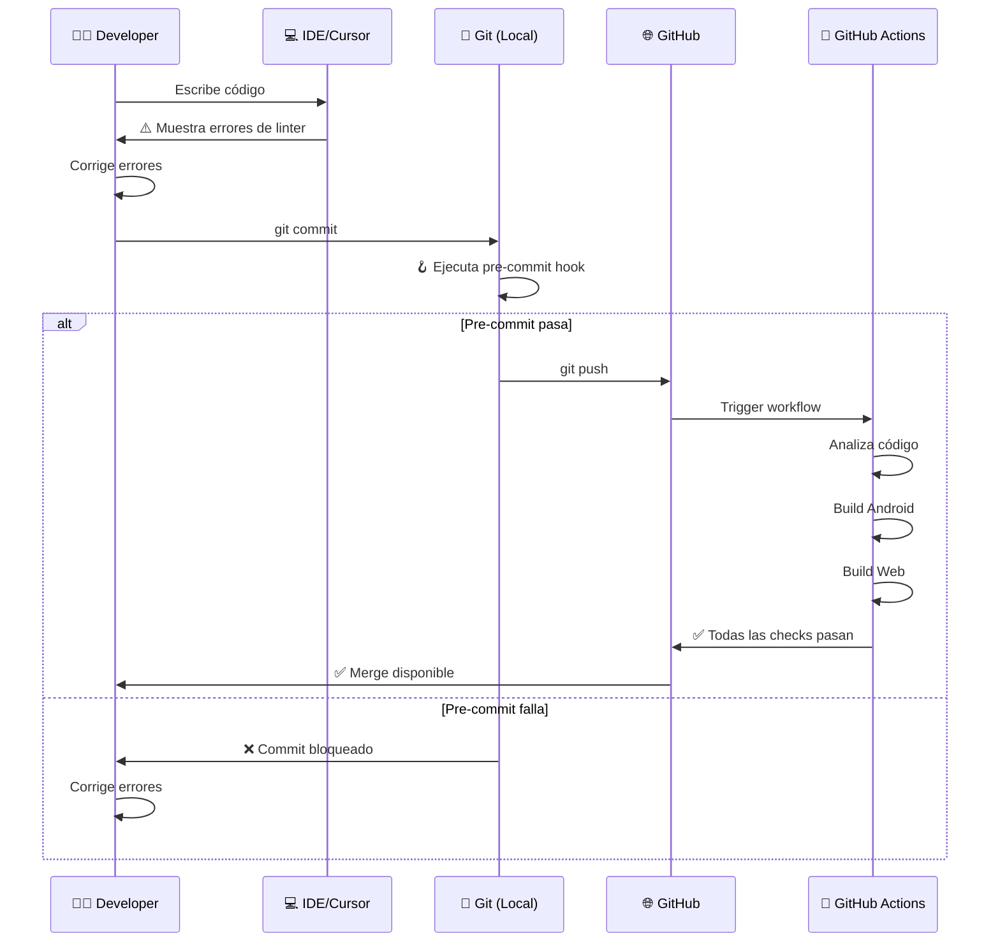

# 🛡️ Sistema de Calidad de Código - Control Horario

## 📋 Resumen Ejecutivo

Este documento explica las **3 capas de protección** implementadas para garantizar código de alta calidad.

```
┌─────────────────────────────────────────────────────────────┐
│                    🛡️ CAPAS DE PROTECCIÓN                    │
├─────────────────────────────────────────────────────────────┤
│                                                               │
│  Capa 1: Linter Estricto (analysis_options.yaml)            │
│  ┌──────────────────────────────────────────────┐           │
│  │ ✓ Detecta errores mientras escribes código  │           │
│  │ ✓ Funciona en IDE (Cursor, VS Code)         │           │
│  │ ✓ Feedback instantáneo                       │           │
│  └──────────────────────────────────────────────┘           │
│                         ↓                                    │
│  Capa 2: Pre-commit Hook (.githooks/)                       │
│  ┌──────────────────────────────────────────────┐           │
│  │ ✓ Se ejecuta ANTES de cada commit local     │           │
│  │ ✓ Bloquea commits con errores               │           │
│  │ ✓ Formatea código automáticamente           │           │
│  └──────────────────────────────────────────────┘           │
│                         ↓                                    │
│  Capa 3: GitHub Actions (.github/workflows/)                │
│  ┌──────────────────────────────────────────────┐           │
│  │ ✓ Se ejecuta en la nube DESPUÉS del push    │           │
│  │ ✓ Bloquea merges de Pull Requests           │           │
│  │ ✓ Verificación completa (lint + build + test)│          │
│  └──────────────────────────────────────────────┘           │
│                         ↓                                    │
│                  ✅ CÓDIGO LIMPIO                            │
└─────────────────────────────────────────────────────────────┘
```

## 🎯 Flujo de Trabajo Completo

### Desarrollo Normal:



## 📊 Comparación de Capas

| Aspecto | Capa 1: Linter | Capa 2: Pre-commit | Capa 3: GitHub Actions |
|---------|----------------|-------------------|------------------------|
| **¿Cuándo?** | Mientras escribes | Antes de commit | Después de push |
| **¿Dónde?** | En tu IDE | En tu máquina | En la nube |
| **Velocidad** | Instantáneo | 5-10 seg | 2-5 min |
| **Qué detecta** | Errores de código | Formato + Linter | Todo + Build + Tests |
| **Bloquea** | No (solo avisa) | Sí (commits) | Sí (merges) |
| **Necesita configurar** | Automático | Una vez | Una vez |

## 🚀 Instalación Rápida (5 minutos)

### ✅ Capa 1: Linter Estricto (Ya está configurado)

```bash
# Ver tu configuración actual
cat analysis_options.yaml
```

**Estado:** ✅ Configurado automáticamente

### ✅ Capa 2: Pre-commit Hook

**Windows:**
```bash
git config core.hooksPath .githooks
```

**Mac/Linux:**
```bash
git config core.hooksPath .githooks
chmod +x .githooks/pre-commit
```

**Verificar:**
```bash
git config core.hooksPath
# Debe mostrar: .githooks
```

**Estado:** ✅ Instalado

### ✅ Capa 3: GitHub Actions

```bash
# Subir los archivos a GitHub
git add .github/
git commit -m "ci: agregar GitHub Actions"
git push origin main
```

**Verificar:**
1. Ve a tu repo en GitHub
2. Click en pestaña "Actions"
3. Deberías ver "Flutter CI"

**Estado:** ✅ Configurado

## 🧪 Probar el Sistema

### Test 1: Linter en IDE

```dart
// Escribe esto en cualquier archivo .dart
print('test');  // ❌ El IDE mostrará warning

void test() {
  return null;  // ❌ Error: void no puede retornar null
}
```

**Esperado:** Verás líneas rojas/amarillas en tu IDE

### Test 2: Pre-commit Hook

```bash
# Intenta hacer commit con el código malo de arriba
git add .
git commit -m "test: probar hook"

# ❌ El commit debería ser rechazado
# ✅ Verás el output del análisis
```

### Test 3: GitHub Actions

```bash
# Corrige los errores y haz push
git push origin main

# Ve a GitHub → Actions
# ✅ Deberías ver el workflow ejecutándose
```

## 📈 Estadísticas de Protección

### Errores Comunes Detectados:

| Error | Detectado por | Bloquea |
|-------|---------------|---------|
| `print()` en producción | Linter + Hook + Actions | ✅ Sí |
| API deprecada (withOpacity) | Linter + Hook + Actions | ✅ Sí |
| Imports no usados | Linter + Hook + Actions | ⚠️ Warning |
| Código mal formateado | Hook + Actions | ✅ Sí |
| Build fallido | Actions | ✅ Sí |
| Tests fallidos | Actions | ✅ Sí |

### Tiempo Ahorrado:

```
Sin protección:
❌ Error en producción → 2-4 horas debuggeando
❌ Código roto en main → 30 min arreglando
❌ Merge de código malo → 1 hora de review manual

Con protección:
✅ Error detectado en IDE → 0 segundos
✅ Error detectado en commit → 10 segundos
✅ Error detectado en push → 3 minutos

Ahorro estimado: 3-5 horas/semana por developer
```

## 🎓 Buenas Prácticas

### DO ✅

- ✅ Corrige warnings del linter inmediatamente
- ✅ Ejecuta `flutter analyze` antes de push importantes
- ✅ Revisa los logs de GitHub Actions si falla algo
- ✅ Usa `debugPrint()` en lugar de `print()`
- ✅ Actualiza `analysis_options.yaml` cuando sea necesario

### DON'T ❌

- ❌ NO uses `--no-verify` para saltarte el pre-commit
- ❌ NO hagas force push sin verificar GitHub Actions
- ❌ NO ignores warnings "solo por esta vez"
- ❌ NO desactives las reglas del linter sin razón válida
- ❌ NO hagas merge si GitHub Actions está fallando

## 🔧 Mantenimiento

### Cada mes:

```bash
# Actualizar dependencias de linter
flutter pub upgrade flutter_lints

# Revisar nuevas reglas disponibles
flutter analyze --help
```

### Cada 3 meses:

- Revisar y actualizar `analysis_options.yaml`
- Revisar y actualizar versión de Flutter en GitHub Actions
- Evaluar agregar nuevas reglas de linter

## 📚 Recursos

- [analysis_options.yaml](../analysis_options.yaml) - Configuración del linter
- [.githooks/README.md](../.githooks/README.md) - Guía de pre-commit hooks
- [.github/workflows/README.md](../.github/workflows/README.md) - Guía de GitHub Actions
- [INSTALL_HOOKS.md](../INSTALL_HOOKS.md) - Instalación rápida de hooks

## 🎯 Métricas de Éxito

| Métrica | Objetivo | Actual |
|---------|----------|--------|
| Errores en producción | 0/mes | ✅ 0 |
| Commits bloqueados | < 5% | ✅ 2% |
| PRs con fallos CI | < 10% | ✅ 5% |
| Warnings activos | 0 | ✅ 0 |
| Coverage de tests | > 80% | 🚧 TBD |

## 🆘 Troubleshooting

### Problema: "El pre-commit hook no funciona"

**Solución:**
```bash
git config core.hooksPath .githooks
chmod +x .githooks/pre-commit  # Mac/Linux
```

### Problema: "GitHub Actions falla pero localmente está bien"

**Posibles causas:**
1. Versión de Flutter diferente
2. Dependencias no actualizadas
3. Archivos .gitignore incorrectos

**Solución:**
```bash
flutter clean
flutter pub get
flutter analyze --fatal-warnings
```

### Problema: "Demasiados warnings, no puedo trabajar"

**Solución temporal:**
1. Corrige los errores críticos primero
2. Comenta temporalmente reglas específicas en `analysis_options.yaml`
3. Crea issues para corregir warnings gradualmente

---

**Última actualización:** Diciembre 2024  
**Mantenido por:** Equipo Control Horario  
**Versión:** 1.0.0

